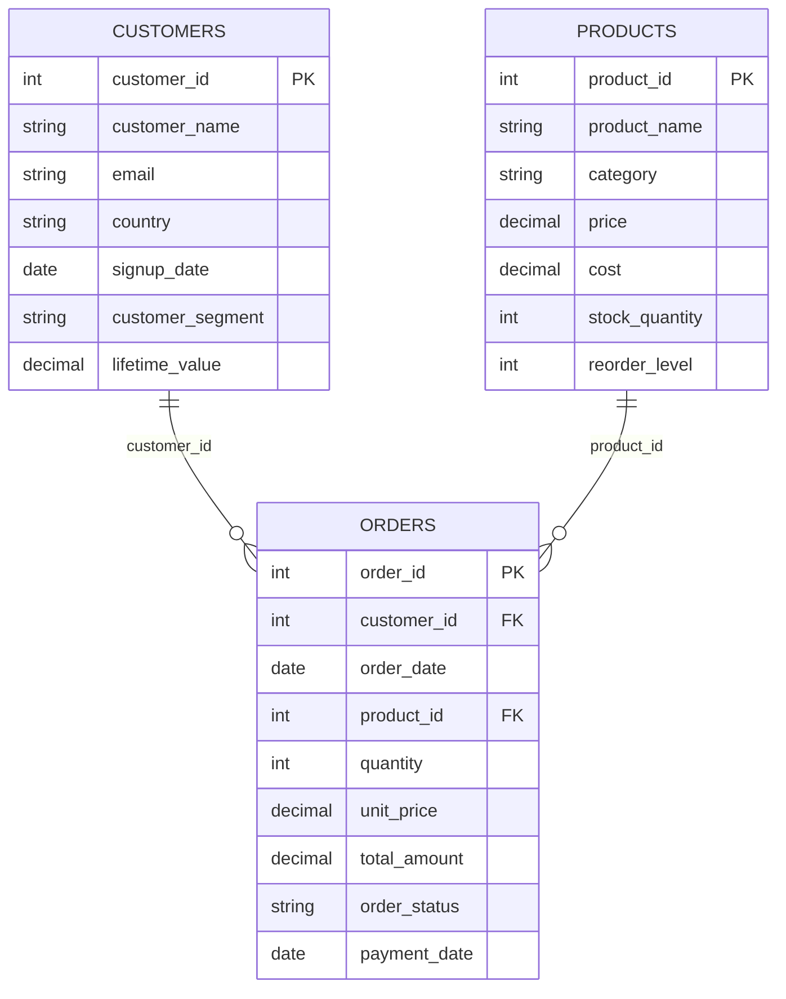

# Data Model

Logical and physical schemas for the three source entities: **customers**, **orders**, and **products**.

Aligned with [requirements-analysis.md](requirements-analysis.md) and [design-notes.md](design-notes.md).

---

## Entity Relationships

### Foreign key relationships

| Parent | Parent key | Child | Child key | Relationship |
|--------|------------|-------|-----------|--------------|
| `customers` | `customer_id` | `orders` | `customer_id` | One customer may have many orders |
| `products` | `product_id` | `orders` | `product_id` | One product may appear on many orders |

**Referential integrity rule (Silver):** every non-null `orders.customer_id` must exist in `customers.customer_id`; every non-null `orders.product_id` must exist in `products.product_id`.

---

## Table Grain

Grain defines what one row represents. Duplicate or defective rows remain at source grain until Gold aggregation.

| Table / file | Expected volume | Grain | Notes |
|--------------|-----------------|-------|-------|
| `customers.csv` | 10,000 rows | **One row per customer record in the file** | Includes duplicate `customer_id` rows (10 extra rows sharing keys with other rows) |
| `orders.csv` | 100,000 rows | **One row per order record in the file** | Includes duplicate `order_id` rows (20 extra rows sharing keys) |
| `products.csv` | 500 rows | **One row per product** | No intentional defects specified; treated as master catalog |
| `bronze.customers` | Same as CSV | One row per ingested CSV row | Raw ingest; no deduplication |
| `bronze.orders` | Same as CSV | One row per ingested CSV row | Raw ingest |
| `bronze.products` | Same as CSV | One row per ingested CSV row | Raw ingest |
| `silver.customers` | Same as Bronze | One row per Bronze row | Typed + quality flags; no silent drops |
| `silver.orders` | Same as Bronze | One row per Bronze row | Typed + quality flags |
| `silver.products` | Same as Bronze | One row per Bronze row | Typed + quality flags |
| `gold.sales_by_product` | ≤ 500 rows | **One row per product** | Aggregated from quality-pass completed orders |
| `gold.revenue_by_customer` | ≤ valid customers | **One row per customer** | Aggregated from quality-pass completed orders |
| `gold.customer_segmentation` | ≤ valid customers | **One row per customer** | Customer-level segmentation attributes |

**Gold grain note:** Gold tables are at master-entity grain (product or customer). Orders are line-level at Silver; they roll up into Gold KPIs.

---

## customers

### Source / logical schema (`customers.csv`)

Canonical business columns. Assessment volume: **10,000 rows**.

| Column | Data type | Nullable | Key | Business meaning |
|--------|-----------|----------|-----|------------------|
| `customer_id` | INT | NOT NULL | **PK** | Stable identifier for a customer; primary key |
| `customer_name` | STRING | NOT NULL | — | Display or legal name of the customer |
| `email` | STRING | NULL allowed in source | — | Customer contact email for communication and identity |
| `country` | STRING | NOT NULL | — | Country associated with the customer account |
| `signup_date` | DATE | NOT NULL | — | Date the customer registered |
| `customer_segment` | STRING | NOT NULL | — | Marketing/service tier: `Premium`, `Standard`, or `Basic` |
| `lifetime_value` | DECIMAL | NOT NULL | — | Estimated or recorded lifetime value of the customer |

### Bronze (`bronze.customers`)

Business columns stored as **STRING** (raw fidelity per design). Plus technical metadata.

| Column | Data type | Nullable | Key | Business meaning |
|--------|-----------|----------|-----|------------------|
| `customer_id` | STRING | NOT NULL | — | Raw `customer_id` from CSV |
| `customer_name` | STRING | NULL | — | Raw name |
| `email` | STRING | NULL | — | Raw email |
| `country` | STRING | NULL | — | Raw country |
| `signup_date` | STRING | NULL | — | Raw date string |
| `customer_segment` | STRING | NULL | — | Raw segment |
| `lifetime_value` | STRING | NULL | — | Raw decimal string |
| `_ingestion_timestamp` | TIMESTAMP | NOT NULL | — | When the row was loaded |
| `_source_file` | STRING | NOT NULL | — | Path of source CSV |
| `_run_id` | STRING | NOT NULL | — | Pipeline run identifier |

**Grain:** one row per CSV row. **PK not enforced** at Bronze.

### Silver (`silver.customers`)

| Column | Data type | Nullable | Key | Business meaning |
|--------|-----------|----------|-----|------------------|
| `customer_id` | INT | NULL if cast fails | **PK (logical)** | Typed customer identifier |
| `customer_name` | STRING | NULL | — | Customer name |
| `email` | STRING | NULL | — | Customer email |
| `country` | STRING | NULL | — | Country |
| `signup_date` | DATE | NULL | — | Signup date |
| `customer_segment` | STRING | NULL | — | Segment enum |
| `lifetime_value` | DECIMAL(18,2) | NULL | — | Lifetime value |
| `quality_check_result` | ARRAY&lt;STRING&gt; | NOT NULL | — | Failure codes for this row |
| `is_quality_pass` | BOOLEAN | NOT NULL | — | `true` when no failure codes |
| `silver_processed_at` | TIMESTAMP | NOT NULL | — | Silver processing time |

**Grain:** one row per Bronze row. Uniqueness of `customer_id` is validated, not enforced by dropping rows.

---

## orders

### Source / logical schema (`orders.csv`)

Assessment volume: **100,000 rows**.

| Column | Data type | Nullable | Key | Business meaning |
|--------|-----------|----------|-----|------------------|
| `order_id` | INT | NOT NULL | **PK** | Unique identifier for an order |
| `customer_id` | INT | NULL allowed in source | **FK → customers.customer_id** | Customer who placed the order |
| `order_date` | DATE | NOT NULL | — | Date the order was created |
| `product_id` | INT | NULL allowed in source | **FK → products.product_id** | Product ordered |
| `quantity` | INT | NOT NULL | — | Number of units ordered |
| `unit_price` | DECIMAL | NOT NULL | — | Price per unit at time of order |
| `total_amount` | DECIMAL | NOT NULL | — | Total monetary value of the order line |
| `order_status` | STRING | NOT NULL | — | Lifecycle state: `Pending`, `Completed`, or `Cancelled` |
| `payment_date` | DATE | **NULL** | — | Date payment was received; nullable by specification |

### Bronze (`bronze.orders`)

Business columns as STRING plus metadata (same pattern as customers).

| Column | Data type | Nullable | Key | Business meaning |
|--------|-----------|----------|-----|------------------|
| `order_id` | STRING | NULL | — | Raw order id |
| `customer_id` | STRING | NULL | — | Raw customer id |
| `order_date` | STRING | NULL | — | Raw order date |
| `product_id` | STRING | NULL | — | Raw product id |
| `quantity` | STRING | NULL | — | Raw quantity |
| `unit_price` | STRING | NULL | — | Raw unit price |
| `total_amount` | STRING | NULL | — | Raw total amount |
| `order_status` | STRING | NULL | — | Raw status |
| `payment_date` | STRING | NULL | — | Raw payment date (may be empty) |
| `_ingestion_timestamp` | TIMESTAMP | NOT NULL | — | Load timestamp |
| `_source_file` | STRING | NOT NULL | — | Source path |
| `_run_id` | STRING | NOT NULL | — | Run identifier |

**Grain:** one row per CSV row.

### Silver (`silver.orders`)

| Column | Data type | Nullable | Key | Business meaning |
|--------|-----------|----------|-----|------------------|
| `order_id` | INT | NULL if cast fails | **PK (logical)** | Typed order identifier |
| `customer_id` | INT | NULL | **FK → silver.customers** | Typed customer reference |
| `order_date` | DATE | NULL | — | Order date |
| `product_id` | INT | NULL | **FK → silver.products** | Typed product reference |
| `quantity` | INT | NULL | — | Quantity |
| `unit_price` | DECIMAL(18,2) | NULL | — | Unit price |
| `total_amount` | DECIMAL(18,2) | NULL | — | Total amount |
| `order_status` | STRING | NULL | — | Order status |
| `payment_date` | DATE | NULL | — | Payment date (nullable) |
| `quality_check_result` | ARRAY&lt;STRING&gt; | NOT NULL | — | Failure codes |
| `is_quality_pass` | BOOLEAN | NOT NULL | — | Pass flag |
| `silver_processed_at` | TIMESTAMP | NOT NULL | — | Processing time |

**Grain:** one row per order record in source. FK integrity checked against Silver/Bronze master id sets.

---

## products

### Source / logical schema (`products.csv`)

Assessment volume: **500 rows**. No intentional defects specified in the assessment.

| Column | Data type | Nullable | Key | Business meaning |
|--------|-----------|----------|-----|------------------|
| `product_id` | INT | NOT NULL | **PK** | Unique product identifier |
| `product_name` | STRING | NOT NULL | — | Name of the product |
| `category` | STRING | NOT NULL | — | Product category for grouping and reporting |
| `price` | DECIMAL | NOT NULL | — | List or selling price |
| `cost` | DECIMAL | NOT NULL | — | Cost to the business |
| `stock_quantity` | INT | NOT NULL | — | Current inventory on hand |
| `reorder_level` | INT | NOT NULL | — | Inventory threshold triggering reorder |

### Bronze (`bronze.products`)

Business columns as STRING plus `_ingestion_timestamp`, `_source_file`, `_run_id` (same metadata pattern).

**Grain:** one row per CSV row.

### Silver (`silver.products`)

| Column | Data type | Nullable | Key | Business meaning |
|--------|-----------|----------|-----|------------------|
| `product_id` | INT | NULL if cast fails | **PK (logical)** | Typed product id |
| `product_name` | STRING | NULL | — | Product name |
| `category` | STRING | NULL | — | Category |
| `price` | DECIMAL(18,2) | NULL | — | Selling price |
| `cost` | DECIMAL(18,2) | NULL | — | Cost |
| `stock_quantity` | INT | NULL | — | Stock on hand |
| `reorder_level` | INT | NULL | — | Reorder threshold |
| `quality_check_result` | ARRAY&lt;STRING&gt; | NOT NULL | — | Failure codes |
| `is_quality_pass` | BOOLEAN | NOT NULL | — | Pass flag |
| `silver_processed_at` | TIMESTAMP | NOT NULL | — | Processing time |

**Grain:** one row per product record in source.

---

## Relationship Detail

### customers.customer_id → orders.customer_id

- **Cardinality:** one-to-many (one customer, many orders).
- **Purpose:** links order revenue and activity to a customer for `gold.revenue_by_customer` and `gold.customer_segmentation`.
- **Silver validation:** `REF_INTEGRITY_FAIL` when `orders.customer_id` is non-null and not found in the set of `customers.customer_id` values from the same pipeline snapshot.
- **NULL handling:** NULL `orders.customer_id` is a **completeness** failure, not a referential failure.

### products.product_id → orders.product_id

- **Cardinality:** one-to-many (one product, many order lines).
- **Purpose:** links orders to product attributes for `gold.sales_by_product`.
- **Silver validation:** `REF_INTEGRITY_FAIL` when `orders.product_id` is non-null and not found in `products.product_id`.
- **NULL handling:** NULL `orders.product_id` is a **completeness** failure.

---

## Intentional Data Quality Issues

Issues embedded in generated CSVs for assessment demonstration. Expected detection in **Silver** unless noted.

### customers

| Issue | Count | Affected column | Check category | Failure code | Check description |
|-------|-------|-----------------|----------------|--------------|-------------------|
| NULL email | 50 | `email` | Completeness | `COMPLETENESS_FAIL` | `email IS NOT NULL` |
| Duplicate `customer_id` | 10 rows (duplicate keys) | `customer_id` | Uniqueness | `UNIQUENESS_FAIL` | `customer_id` appears more than once; all rows in duplicate groups flagged |

**Metrics expectation:** `email_not_null` → 50 failures; `customer_id_unique` → 10 failures (rows participating in duplicate key groups).

### orders

| Issue | Count | Affected column | Check category | Failure code | Check description |
|-------|-------|-----------------|----------------|--------------|-------------------|
| NULL `customer_id` | 100 | `customer_id` | Completeness | `COMPLETENESS_FAIL` | `customer_id IS NOT NULL` |
| NULL `product_id` | 200 | `product_id` | Completeness | `COMPLETENESS_FAIL` | `product_id IS NOT NULL` |
| Invalid `customer_id` (not in customers) | 50 | `customer_id` | Referential integrity | `REF_INTEGRITY_FAIL` | Value not in `customers.customer_id` (non-null values only) |
| Invalid `product_id` (not in products) | 30 | `product_id` | Referential integrity | `REF_INTEGRITY_FAIL` | Value not in `products.product_id` (non-null values only) |
| Duplicate `order_id` | 20 rows (duplicate keys) | `order_id` | Uniqueness | `UNIQUENESS_FAIL` | `order_id` appears more than once; all rows in duplicate groups flagged |

**Overlap note:** A single order row may fail multiple checks (e.g. NULL `customer_id` and invalid `product_id`). All applicable codes accumulate in `quality_check_result`.

**Row-level failure count vs issue count:** The table lists issue **instances** (e.g. 100 rows with NULL `customer_id`). Total flagged rows may exceed these counts when rows fail multiple checks.

### products

| Issue | Count | Notes |
|-------|-------|-------|
| None specified | — | Master catalog assumed clean; Silver still runs completeness, uniqueness, and type validation |

### Checks not tied to intentional defects

These apply to all rows and detect defects if present in data or cast failures:

| Entity | Check category | Failure code | Examples |
|--------|----------------|--------------|----------|
| All | Type validation | `TYPE_VALIDATION_FAIL` | Invalid date strings, non-numeric decimals, enum violations |
| orders | Consistency (optional) | `CONSISTENCY_FAIL` | `payment_date` NULL when `order_status = 'Completed'` |

Type validation does not have pre-specified defect counts in the assessment but must be implemented in Silver.

---

## Quality Check Summary by Category

| Category | customers | orders | products |
|----------|-----------|--------|----------|
| **Completeness** | `customer_id`, `customer_name`, `email`, required fields | `order_id`, `customer_id`, `product_id`, `order_date`, `quantity`, `unit_price`, `total_amount`, `order_status` | `product_id`, `product_name`, core fields |
| **Uniqueness** | `customer_id` | `order_id` | `product_id` |
| **Type validation** | DATE, DECIMAL, segment enum | DATE, INT, DECIMAL, status enum | DECIMAL, INT fields |
| **Referential integrity** | — | `customer_id` → customers; `product_id` → products | — |

---

## Gold Tables (reference grain)

Not source entities, but downstream consumers of the models above.

| Table | Grain | Primary key | Built from |
|-------|-------|-------------|------------|
| `gold.sales_by_product` | One row per product | `product_id` | `silver.products` + `silver.orders` (pass, Completed) |
| `gold.revenue_by_customer` | One row per customer | `customer_id` | `silver.customers` + `silver.orders` (pass, Completed) |
| `gold.customer_segmentation` | One row per customer | `customer_id` | `silver.customers` + order aggregates |

Rows failing Silver quality checks or orders not `Completed` do not contribute to Gold revenue and sales metrics.
