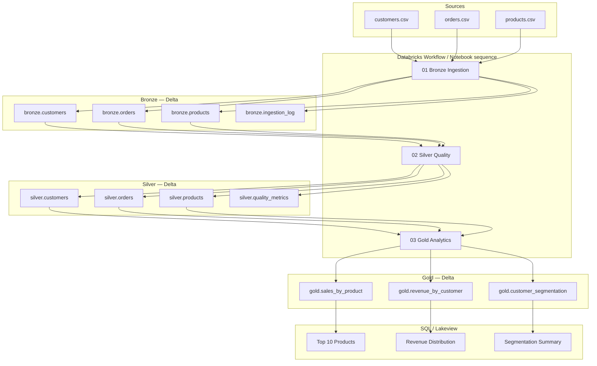
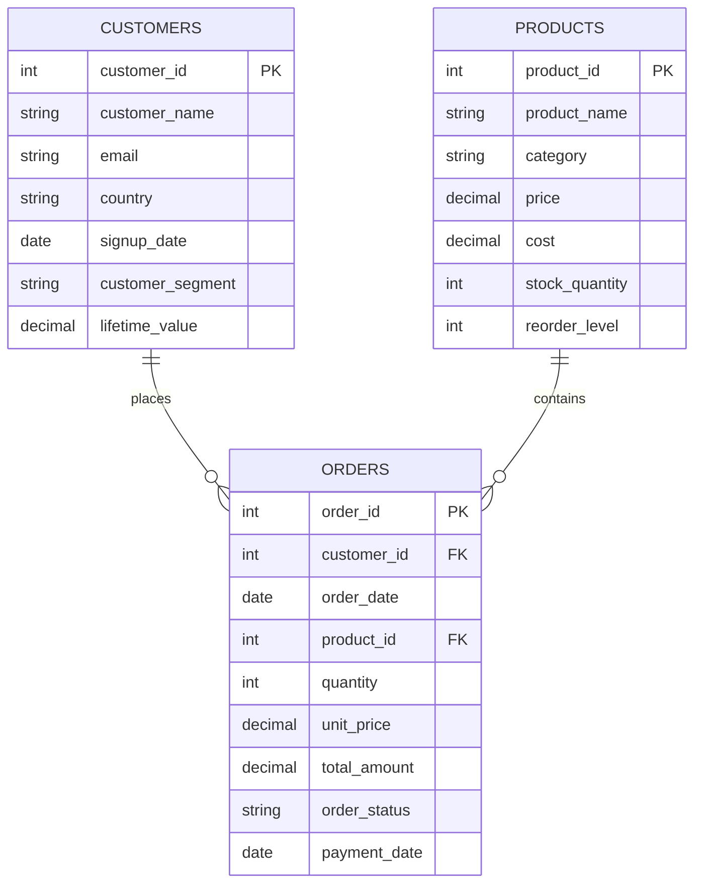

# Design Notes

Databricks Medallion Architecture for e-commerce batch analytics: **CSV → Bronze → Silver → Gold → Dashboard**.

This design aligns with [requirements-analysis.md](requirements-analysis.md). It favors clarity, auditability, and assessment demonstrability over enterprise-scale complexity.

---

## 1. Architecture Overview



**Components**

| Component | Role |
|-----------|------|
| CSV sources | Landing-zone files (DBFS, Unity Catalog Volume, or cloud storage mount) |
| Bronze notebooks / `src` modules | Raw ingest, schema enforcement, ingestion audit |
| Silver notebooks / modules | Typing, DQ checks, flagging, metrics |
| Gold notebooks / modules | Business aggregates from quality-pass rows |
| SQL files | Dashboard queries over Gold Delta tables |
| Config (`config/pipeline_config.yaml`) | Paths, catalog, table names, run parameters |
| Tests (`tests/`) | Unit + integration with fixture CSVs |

**Catalog layout (default)**

- Catalog: configurable (`main` or dev catalog)
- Schemas: `bronze`, `silver`, `gold`
- Storage: Delta on cloud storage path (e.g. `abfss://.../medallion/{layer}/{table}`)

**Orchestration**

- Assessment: three dependent notebooks run in order.
- Production pattern: Databricks Workflow with tasks `bronze → silver → gold`, email/alert on failure, optional schedule.

---

## 2. Data Flow

| Step | From | To | Key action |
|------|------|-----|------------|
| 1 | CSV | Bronze Delta | Read with explicit schema; append metadata columns; write Delta |
| 2 | Bronze | Silver Delta | Cast types; run DQ checks; set `quality_check_result`, `is_quality_pass` |
| 3 | Silver | `silver.quality_metrics` | Aggregate failure counts by check and table |
| 4 | Silver (pass) | Gold Delta | Filter `is_quality_pass = true`; aggregate for analytics |
| 5 | Gold | Dashboard SQL | Read-only queries for Lakeview or SQL warehouse |

**Dependency order**

1. `products` and `customers` Silver before `orders` Silver (FK checks need master keys).
2. Gold reads all three Silver tables after Silver completes.

**Quality-pass filter for Gold (design default)**

- Silver row is pass-eligible when `is_quality_pass = true`.
- Orders additionally used in revenue only when `order_status = 'Completed'` (assumption; see Section 13).

---

## 3. Data Model

### Entity relationships



### Layer table inventory

| Layer | Table | Grain | Purpose |
|-------|-------|-------|---------|
| Bronze | `bronze.customers` | 1 row per CSV row | Raw customer ingest |
| Bronze | `bronze.orders` | 1 row per CSV row | Raw order ingest |
| Bronze | `bronze.products` | 1 row per CSV row | Raw product ingest |
| Bronze | `bronze.ingestion_log` | 1 row per ingest attempt | Audit |
| Silver | `silver.customers` | 1 row per Bronze row | Typed + DQ flags |
| Silver | `silver.orders` | 1 row per Bronze row | Typed + DQ flags |
| Silver | `silver.products` | 1 row per Bronze row | Typed + DQ flags |
| Silver | `silver.quality_metrics` | 1 row per check per run | DQ monitoring |
| Gold | `gold.sales_by_product` | 1 row per product | Product sales KPIs |
| Gold | `gold.revenue_by_customer` | 1 row per customer | Customer revenue KPIs |
| Gold | `gold.customer_segmentation` | 1 row per customer | Segmentation view |

### Gold output definitions

**`gold.sales_by_product`**

| Column | Description |
|--------|-------------|
| `product_id`, `product_name`, `category` | Product identity |
| `total_quantity` | Sum of `quantity` on completed, quality-pass orders |
| `total_revenue` | Sum of `total_amount` |
| `order_count` | Distinct `order_id` count |
| `avg_unit_price` | Mean `unit_price` on included orders |
| `last_updated` | Pipeline run timestamp |

**`gold.revenue_by_customer`**

| Column | Description |
|--------|-------------|
| `customer_id`, `customer_name`, `country`, `customer_segment` | Customer identity |
| `total_revenue`, `order_count`, `avg_order_value` | Revenue KPIs |
| `last_order_date` | Max `order_date` on included orders |
| `last_updated` | Pipeline run timestamp |

**`gold.customer_segmentation`**

| Column | Description |
|--------|-------------|
| `customer_id` | PK |
| `source_segment` | From `customer_segment` (Premium/Standard/Basic) |
| `total_revenue` | From completed quality-pass orders |
| `lifetime_value` | From Silver customers |
| `revenue_tier` | Derived: High / Medium / Low by revenue thresholds |
| `activity_tier` | Derived: Active / Inactive based on order presence |
| `derived_segment` | Combined label for dashboard (e.g. source + revenue tier) |
| `last_updated` | Pipeline run timestamp |

---

## 4. Bronze Layer Design

### Input

- `customers.csv`, `orders.csv`, `products.csv` from configured landing path.
- Expected row counts: 10k / 100k / 500 (validated post-read, not as hard fail unless zero rows).

### Output

- Delta tables: `bronze.customers`, `bronze.orders`, `bronze.products`
- Audit Delta table: `bronze.ingestion_log`

### Transformations

- **Allowed:** read CSV, apply explicit schema, add technical metadata.
- **Not allowed:** business rules, deduplication, FK enforcement, null filling, revenue logic.

**Technical metadata columns (all Bronze entity tables)**

| Column | Type | Purpose |
|--------|------|---------|
| `_ingestion_timestamp` | TIMESTAMP | When row was loaded |
| `_source_file` | STRING | Source path |
| `_run_id` | STRING | Pipeline run identifier |

**Schema approach**

- Define expected columns and types in config (`config/schemas/*.json` or PySpark `StructType`).
- Read CSV with explicit schema and `mode="PERMISSIVE"` for malformed values → captured in `_corrupt_record` if needed, or null with type mismatch logged at Silver.
- Alternative (chosen): read business columns as **STRING** in Bronze to maximize raw fidelity; cast in Silver. Metadata columns still typed.

### Data persistence

- Format: **Delta Lake**
- Mode: **overwrite** per table per pipeline run (assessment simplicity + idempotency).
- Optional: partition by `_ingestion_timestamp` date if append mode is adopted later.

### Failure handling

| Failure | Behavior |
|---------|----------|
| File not found | Fail task; log `FAILED` row in `ingestion_log` with error message |
| Missing required column | Fail task; no partial table overwrite (or overwrite with empty + failed log — prefer fail-fast) |
| Empty file | Log `FAILED` or `SUCCESS` with `row_count = 0`; downstream Silver may produce empty outputs |
| Spark read error | Catch, log to `ingestion_log`, raise to stop workflow |

### Validation (Bronze)

- Pre-read: path exists, file non-empty (configurable).
- Post-read: column set matches expected schema.
- Post-write: `row_count` matches read count; write `ingestion_log` entry with `SUCCESS`.

---

## 5. Silver Layer Design

### Input

- `bronze.customers`, `bronze.orders`, `bronze.products` (current overwrite snapshot).

### Output

- `silver.customers`, `silver.orders`, `silver.products`
- `silver.quality_metrics`

### Transformations

1. Cast Bronze strings to target types (INT, DATE, DECIMAL).
2. Apply DQ rules (see Section 7).
3. Build `quality_check_result` as `ARRAY<STRING>` of failure codes.
4. Set `is_quality_pass = size(quality_check_result) = 0`.
5. Add `silver_processed_at` timestamp.

**Processing order**

1. Silver `products` and `customers` (no cross-FK dependency between them).
2. Silver `orders` (FK checks join to Silver masters built from same Bronze snapshot — use distinct valid IDs from Bronze/Silver customers and products).

### Data persistence

- Format: **Delta Lake**
- Mode: **overwrite** per run (full recompute from Bronze).
- `quality_metrics`: overwrite per run or append with `run_id` (append preferred for trend visibility; overwrite acceptable for assessment).

### Failure handling

| Failure | Behavior |
|---------|----------|
| Bronze table missing | Fail Silver task with explicit error |
| Cast failure on row | Flag `TYPE_VALIDATION_FAIL`; do not abort pipeline |
| DQ failures | Flag rows; continue processing all rows |
| Unhandled Spark exception | Fail task; Gold must not run (workflow dependency) |

### Validation (Silver)

- Completeness, uniqueness, type, referential integrity per Section 7.
- Post-run: write metrics; optional assertion in tests for known defect counts.

---

## 6. Gold Layer Design

### Input

- `silver.customers`, `silver.orders`, `silver.products` where `is_quality_pass = true`.
- Orders subset: `order_status = 'Completed'` for revenue/sales metrics.

### Output

- `gold.sales_by_product`
- `gold.revenue_by_customer`
- `gold.customer_segmentation`

### Transformations

**Sales by Product**

- Join quality-pass products with quality-pass completed orders.
- Group by `product_id` (and name/category from products).
- Aggregate quantity, revenue, order count, average unit price.

**Revenue by Customer**

- Join quality-pass customers with quality-pass completed orders.
- Group by `customer_id`.
- Compute revenue, order count, AOV, last order date.

**Customer Segmentation**

- Start from quality-pass customers.
- Left join revenue aggregates (customers with no completed orders → zero revenue).
- Map `source_segment` from customer table.
- Derive `revenue_tier` and `activity_tier` using documented thresholds in config.
- Build `derived_segment` for dashboard consumption.

### Data persistence

- Format: **Delta Lake**
- Mode: **overwrite** per run (full rebuild from Silver).
- Add `last_updated` on all Gold tables.

### Failure handling

| Failure | Behavior |
|---------|----------|
| Silver tables missing | Fail Gold task |
| Empty quality-pass orders | Gold tables created with zero/empty aggregates where applicable |
| Join explosions | Prevented by PK grain on masters; duplicates already flagged in Silver |

### Validation (Gold)

- Sanity checks: no negative revenue totals; row counts ≤ Silver master counts.
- Tests: hand-calculated expected revenue on fixture subset.

---

## 7. Data Quality Validation Strategy

### Principles

- Rules are **declarative** and **repeatable** (config or dedicated `quality_checks` module).
- Failures are **visible** on the row and **summarized** in metrics.
- No silent deletes in Silver.

### Standard failure codes

| Code | Category | Example |
|------|----------|---------|
| `COMPLETENESS_FAIL` | Completeness | NULL `email`, NULL `customer_id` on orders |
| `UNIQUENESS_FAIL` | Uniqueness | Duplicate `customer_id` or `order_id` |
| `TYPE_VALIDATION_FAIL` | Type validation | Unparseable date, non-numeric decimal |
| `REF_INTEGRITY_FAIL` | Referential integrity | `customer_id` not in customers |
| `CONSISTENCY_FAIL` | Optional business rule | `payment_date` NULL on Completed order |

### Rules by entity

**Customers**

| Check | Rule | Code |
|-------|------|------|
| Completeness | `customer_id`, `customer_name` NOT NULL | `COMPLETENESS_FAIL` |
| Completeness | `email` NOT NULL | `COMPLETENESS_FAIL` |
| Uniqueness | `customer_id` unique across table | `UNIQUENESS_FAIL` on duplicates |
| Type | Valid DATE for `signup_date`; DECIMAL for `lifetime_value` | `TYPE_VALIDATION_FAIL` |
| Type | `customer_segment` in {Premium, Standard, Basic} if not null | `TYPE_VALIDATION_FAIL` |

**Products**

| Check | Rule | Code |
|-------|------|------|
| Completeness | `product_id`, `product_name` NOT NULL | `COMPLETENESS_FAIL` |
| Uniqueness | `product_id` unique | `UNIQUENESS_FAIL` |
| Type | `price`, `cost` DECIMAL; `stock_quantity`, `reorder_level` INT | `TYPE_VALIDATION_FAIL` |

**Orders**

| Check | Rule | Code |
|-------|------|------|
| Completeness | `order_id`, `order_date`, `quantity`, `unit_price`, `total_amount`, `order_status` NOT NULL | `COMPLETENESS_FAIL` |
| Completeness | `customer_id`, `product_id` NOT NULL | `COMPLETENESS_FAIL` |
| Uniqueness | `order_id` unique | `UNIQUENESS_FAIL` |
| Type | Valid dates; numeric fields parseable; status in enum | `TYPE_VALIDATION_FAIL` |
| Referential integrity | `customer_id` exists in customers | `REF_INTEGRITY_FAIL` |
| Referential integrity | `product_id` exists in products | `REF_INTEGRITY_FAIL` |
| Consistency (optional) | `payment_date` required when `order_status = 'Completed'` | `CONSISTENCY_FAIL` |

**Duplicate handling (design decision)**

- All duplicate PK rows remain in Silver.
- Every row participating in a duplicate key group receives `UNIQUENESS_FAIL`.
- Gold excludes all flagged rows from aggregates.

### Quality metrics (`silver.quality_metrics`)

| Column | Description |
|--------|-------------|
| `run_id` | Pipeline run |
| `table_name` | e.g. `silver.orders` |
| `check_type` | Completeness / Uniqueness / Type validation / Referential integrity |
| `check_name` | e.g. `customer_id_not_null` |
| `failed_count` | Rows failing this check |
| `total_count` | Total rows in table |
| `failure_rate` | `failed_count / total_count` |
| `measured_at` | Timestamp |

Grain: one row per check per table per run.

---

## 8. Error Handling

### Input validation (pre-pipeline)

- Validate config loads successfully.
- Validate source paths exist for all three CSVs.
- Validate expected column lists match schema definitions.

### Layer-level errors

| Layer | Recoverable | Fatal |
|-------|-------------|-------|
| Bronze | — | Missing file, schema mismatch, write failure |
| Silver | Row-level DQ failures | Missing Bronze, table write failure |
| Gold | Empty analytic result | Missing Silver, write failure |

### Exception handling pattern

- Wrap each notebook main in try/except.
- On failure: log to `bronze.ingestion_log` (or a generic `pipeline_run_log` if Silver/Gold fails), set workflow task status failed, do not run downstream tasks.
- Use custom exceptions (`PipelineValidationError`, `IngestionError`) in `src` for clarity.

### Partial failure visibility

- Workflow stops at failed task.
- `ingestion_log` shows which Bronze files succeeded.
- Silver/Gold not refreshed if upstream failed — consumers must check log timestamps vs Gold `last_updated`.

---

## 9. Logging and Audit Strategy

### Bronze ingestion log (`bronze.ingestion_log`)

| Column | Type |
|--------|------|
| `log_id` | STRING |
| `run_id` | STRING |
| `source_path` | STRING |
| `target_table` | STRING |
| `row_count` | BIGINT |
| `ingestion_timestamp` | TIMESTAMP |
| `status` | STRING (`SUCCESS` / `FAILED`) |
| `error_message` | STRING |

One row per source file per ingest attempt.

### Silver quality metrics

- Documented in Section 7; primary DQ audit artifact.

### Application logging

- Python `logging` in modules: INFO for row counts and timings; ERROR for failures.
- Databricks driver logs capture stack traces for debugging.

### Audit questions this supports

- When was data last loaded?
- How many rows per source?
- Which DQ checks failed and at what rate?
- Which pipeline run produced current Gold?

---

## 10. Testing Strategy

### Scope

| Test type | What | Where |
|-----------|------|-------|
| Unit | Individual DQ functions, tier logic, validation helpers | `tests/unit/` |
| Integration | Bronze → Silver on fixtures; defect count assertions | `tests/integration/` |
| SQL smoke | Dashboard queries execute; expected columns present | `tests/` or notebook assertions |
| Manual | Full 10k/100k/500 CSV run on Databricks | Job run + Lakeview |

### Fixtures (`data/fixtures/`)

Small CSVs covering:

- NULL email, duplicate `customer_id`
- NULL/invalid FKs, duplicate `order_id`
- Clean products baseline
- Invalid date and numeric strings

### Key assertions

- Bronze row count equals CSV row count.
- Silver failure counts match intentional defects (±0 on full data).
- Gold revenue matches manual calculation on fixture.
- Flagged rows excluded from Gold aggregates.

### Test execution

- Local: `pytest` with `SparkSession` (local mode) and temp Delta paths.
- CI (optional): GitHub Actions with Java + Spark — document if not wired.

### Not in scope (avoid over-engineering)

- Performance benchmarks, chaos testing, multi-environment promotion gates.

---

## 11. Debugging Approach

### Common issues and checks

| Symptom | Check |
|---------|-------|
| Gold revenue too high | Duplicate orders not flagged; Bronze double-loaded |
| Gold revenue too low | Over-aggressive `is_quality_pass`; Completed filter |
| FK failures spike | Silver customers/products not built before orders |
| Cast failures | Inspect Bronze raw strings; CSV encoding |
| Empty Gold table | All Silver rows failed DQ; check `quality_metrics` |

### Debug queries (examples)

```sql
-- Rows failing a specific check
SELECT * FROM silver.orders
WHERE array_contains(quality_check_result, 'REF_INTEGRITY_FAIL');

-- Latest ingestion status
SELECT * FROM bronze.ingestion_log
ORDER BY ingestion_timestamp DESC;

-- DQ summary for latest run
SELECT * FROM silver.quality_metrics
ORDER BY measured_at DESC;
```

### Databricks tooling

- Notebook replay per layer with `%run` or imported modules.
- Delta table history: `DESCRIBE HISTORY bronze.orders`
- Spark UI for skew and failed stages on full data runs.

Document detailed steps in `docs/debugging_notes.md` during implementation.

---

## 12. Reprocessing / Idempotency Strategy

### Design choice: overwrite per run

| Layer | Strategy | Idempotent? |
|-------|----------|-------------|
| Bronze entity tables | `overwrite` full table each run | Yes — same CSV → same Bronze |
| Bronze `ingestion_log` | `append` with `run_id` | Audit history preserved |
| Silver entity tables | `overwrite` from current Bronze | Yes |
| Silver `quality_metrics` | `append` with `run_id` | Historical trends |
| Gold tables | `overwrite` from current Silver | Yes |

### Reprocessing scenarios

| Scenario | Action |
|----------|--------|
| Same CSV re-ingested | Bronze overwrite replaces content; Silver/Gold rebuild |
| Corrected CSV | Replace landing file; rerun full pipeline |
| Silver logic change only | Rerun Silver + Gold (skip Bronze if source unchanged) |
| Gold logic change only | Rerun Gold |
| Partial workflow failure | Fix root cause; rerun from failed task |

### Run identifier

- Generate `run_id` (UUID or timestamp-based) at workflow start.
- Propagate to Bronze metadata, `ingestion_log`, `quality_metrics`, Gold `last_updated`.

---

## 13. Assumptions and Trade-offs

### Assumptions (from requirements analysis)

- Revenue uses `total_amount` on **Completed** orders only.
- Gold consumes Silver only; quality-pass filtering happens before aggregates.
- Silver keeps all rows; Gold excludes failed rows.
- Dashboard SQL targets Gold Delta tables in Databricks.
- Duplicate PK rows all remain flagged; none are canonicalized in Silver.

### Design decisions resolving ambiguities

| Topic | Decision | Trade-off |
|-------|----------|-----------|
| Bronze typing | Business columns as STRING; cast in Silver | Preserves raw values; casting complexity in Silver |
| Bronze load | Overwrite entity tables | Simple idempotency; no historical Bronze snapshots |
| Email NULL | Hard fail (`is_quality_pass = false`) | Aligns with completeness category demo |
| Customer Segmentation | Source segment + derived revenue/activity tiers | Richer dashboard; slightly more logic |
| `total_amount` vs calc | `total_amount` authoritative; optional consistency check | Mismatch rows flagged if rule enabled |
| Unity Catalog | Config-driven catalog/schema names | Works in dev and UC-enabled workspaces |
| Dashboard | SQL files + Lakeview instructions in README | No custom UI code |

### Intentional simplifications (assessment scope)

- No streaming, CDC, or incremental merges.
- No separate quarantine Delta tables (failed rows remain in Silver with flags).
- No data lineage tool integration (Delta history + logs suffice).
- Single environment config; no separate dev/staging/prod promotion pipeline.
- No secrets or external API ingestion.

### Production extensions (out of scope, noted for realism)

- Append + `merge` for incremental Bronze loads.
- Unity Catalog row/column masks for PII (`email`).
- Expectations framework (e.g. DLT expectations) if team standardizes on Delta Live Tables.
- SLA monitoring and alerting on `quality_metrics` thresholds.

---

## Layer Summary Matrix

| Layer | Input | Output | Transformations | Persistence | Failure handling | Validation |
|-------|-------|--------|-----------------|---------------|------------------|------------|
| **Bronze** | 3 CSVs | 3 Delta tables + log | Schema read, metadata columns | Delta overwrite | Fail-fast on missing/invalid source | Column + row count checks |
| **Silver** | Bronze Delta | 3 Silver tables + metrics | Cast, DQ flags, pass bit | Delta overwrite (+ metrics append) | Row DQ non-fatal; task fatal on missing upstream | 4 DQ categories + metrics |
| **Gold** | Silver (pass) | 3 Gold KPI tables | Join, filter Completed, aggregate | Delta overwrite | Fail on missing Silver | Sanity checks + tests |
| **Dashboard** | Gold Delta | Query results / visuals | None (read-only SQL) | N/A | Query errors surfaced in SQL warehouse | Smoke tests on fixtures |
